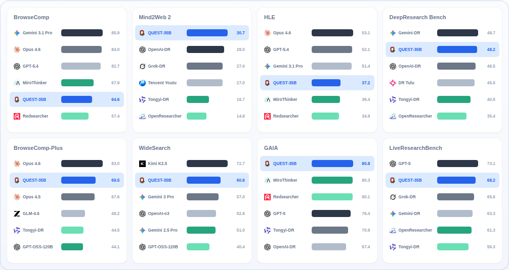
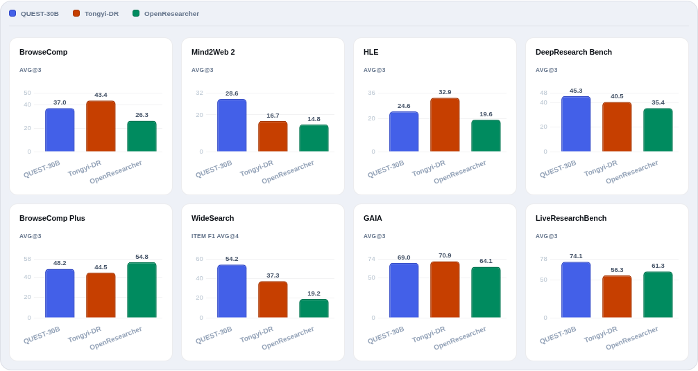
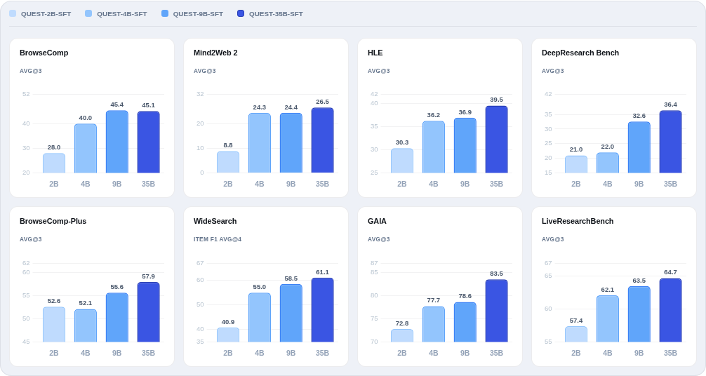
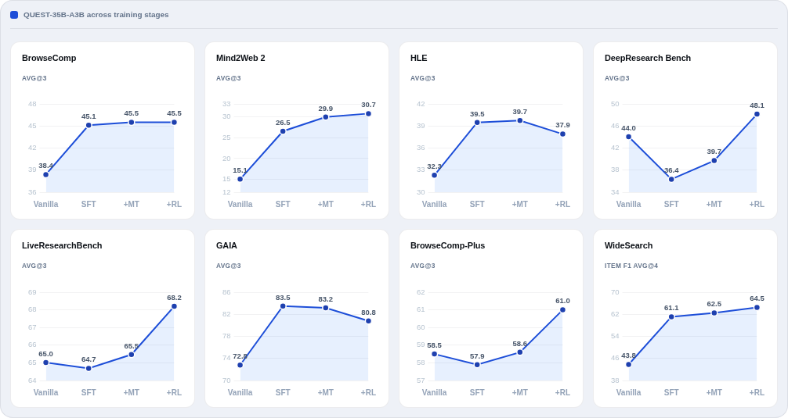

# QUEST

<div align="center" style="line-height: 1; margin-top: 16px;">
  <a href="#"></a>
  <a href="https://osu-nlp-group.github.io/QUEST/"></a>
  <a href="https://huggingface.co/collections/osunlp/quest"></a>
  <a href="https://huggingface.co/osunlp/QUEST-35B-RL"></a>
</div>

## Introduction

Quest is a general-purpose Deep Search Agent designed to handle a wide range of
search tasks, with strong capabilities in fact seeking, citation grounding, and
report synthesis.

## Table of Contents

- [Introduction](#introduction)
- [Updates](#updates)
- [Resources](#resources)
- [Results Snapshot](#results-snapshot)
- [Environment Setup](#environment-setup)
- [Runtime Configuration](#runtime-configuration)
- [Benchmark Replication](#benchmark-replication)
  - [Inference](#inference)
  - [Evaluation](#evaluation)
- [Mid-training / SFT Training](#mid-training--sft-training)
- [Run Training](#run-training)
  - [RL Backend](#rl-backend)
- [Data Generation](#data-generation)
  - [Objective Tasks](#objective-tasks)
  - [Objective Verifier Scripts](#objective-verifier-scripts)
  - [Open-Ended Tasks](#open-ended-tasks)
  - [Open-Ended Evaluation](#open-ended-evaluation)
- [Citation](#citation)
- [Documentation Map](#documentation-map)

## Updates

- **14/05/2026**: We released QUEST, including model checkpoints, data, and code.

## Resources

 All released models and
datasets are organized in the
[Hugging Face collection](https://huggingface.co/collections/osunlp/quest).
You can also try the hosted [demo](https://huggingface.co/spaces/osunlp/QUEST).

| Type | Resources |
| --- | --- |
| 35B checkpoints | [RL](https://huggingface.co/osunlp/QUEST-35B-RL), [MT+SFT](https://huggingface.co/osunlp/QUEST-35B-MT-Plus-SFT), [MT](https://huggingface.co/osunlp/QUEST-35B-MT), [SFT](https://huggingface.co/osunlp/QUEST-35B-SFT) |
| 30B checkpoints | [RL](https://huggingface.co/osunlp/QUEST-30B-RL), [MT+SFT](https://huggingface.co/osunlp/QUEST-30B-MT-Plus-SFT), [SFT](https://huggingface.co/osunlp/QUEST-30B-SFT) |
| Smaller checkpoints | [9B](https://huggingface.co/osunlp/QUEST-9B), [4B](https://huggingface.co/osunlp/QUEST-4B), [2B](https://huggingface.co/osunlp/QUEST-2B) |
| Training data | [RL data](https://huggingface.co/datasets/osunlp/QUEST-RL-Data), [SFT objective data](https://huggingface.co/datasets/osunlp/QUEST-SFT-Data-Objective), [SFT open-ended data](https://huggingface.co/datasets/osunlp/QUEST-SFT-Data-Open-ended) |

Model selection note: if you only need to evaluate objective tasks and do not
need open-ended task evaluation, we recommend the MT+SFT checkpoints because
they perform better on objective benchmarks. For more comprehensive evaluation
across both objective and open-ended tasks, we recommend the RL checkpoints.

Release note: cached databases and mid-training data are still under legal
review. We will release them only after confirming that their release is legally
compliant.

## Results Snapshot

**Overall benchmark snapshot.** QUEST-35B is compared with leading proprietary
and open deep research agents across eight benchmarks covering fact seeking,
citation grounding, and report synthesis.

<p align="center">
  
</p>

**30B-scale comparison.** QUEST-30B is compared against other open research
agents of similar scale, highlighting its performance across objective and
open-ended benchmarks.

<p align="center">
  
</p>

**Scaling across QUEST checkpoints.** Smaller QUEST models show consistent
gains as model size increases from 2B to 35B on representative benchmarks.

<p align="center">
  
</p>

**Training-stage ablation.** The training recipe is broken down across vanilla,
SFT, mid-training, and RL stages to show where each stage improves final
performance.

<p align="center">
  
</p>

## Environment Setup

Create an environment and install the shared runtime dependencies:

```bash
pip install -r requirements.txt
```

This environment is intended for inference, data generation, and evaluation
workflows. Training uses separate backend stacks: install SFT dependencies under
`training_scripts/sft/` according to LlamaFactory requirements, and install RL
dependencies under `training_scripts/rl/` according to VERL requirements.

Optional local databases and caches used by search, visit, and scholar tools
live under the repository-level `database/` directory:

```text
database/
```

These files are not included in the repository. If you do not download existing
databases, the search and visit caches are created automatically during runs.
Providing prebuilt databases is useful when you want to reuse cached results,
reduce external requests, or run workflows that require prepared search/scholar
indexes.

## Runtime Configuration

The exact environment variables depend on the workflow. Common groups include:

| Group | Examples | Used By |
| --- | --- | --- |
| Search | `SERPER_KEY_ID` | Search and scholar fallback |
| Visit | `JINA_API_KEYS` | Page reading and page summarization |
| Azure/OpenAI-compatible | `API_KEY`, `API_BASE`, `AZURE_OPENAI_ENDPOINT`, `AZURE_OPENAI_API_VERSION`, `AZURE_OPENAI_DEPLOYMENT` | Shared legacy and fallback LLM paths |
| Inference summary and memory | `SUMMARY_MODEL_NAME`, `MEMORY_MODEL_NAME`, `MEMORY_API_KEY`, `MEMORY_API_BASE` | Visit summarization and memory condensation |
| Reward/eval LLMs | `EVAL_LLM_*`, `CITATION_EVAL_LLM_*`, `OPENENDED_EVAL_LLM_*` | Objective, citation, and open-ended reward evaluation |
| Services | `SEARCH_NODES_CONF`, `SCHOLAR_NODES_CONF`, `PYTHON_NODES_CONF`, `EVAL_LLM_NODES_CONF` | Tool and local eval-node routing |

For inference, see [`inference/api_config.yaml`](inference/api_config.yaml) for
the default configuration template. For the full RL backend environment list,
see the [DeepResearch recipe README](training_scripts/rl/recipe/deepresearch/README.md#secrets-and-environment).
Any `<HOST_IP>` or `[PLACEHOLDER]` values in committed configs are
examples only. Replace them with the real host IPs, ports, model paths, and
credentials for your own inference, evaluation, or training deployment.

## Benchmark Replication

### Inference

Use `inference/` when you have a model endpoint and want to run benchmark
predictions with the QUEST agent.

Before launching, configure:

```text
api_config.yaml
server_endpoints.conf
```

Then check the benchmark script and update:

```text
DATASET
OUTPUT_PATH
TASK_LOG_DIR
MODEL_PATH
MAX_WORKERS
MEMORY_THRESHOLD
LLM_MAX_TOKENS
API_CONFIG_FILE
SERVER_ENDPOINTS_FILE
```

Run the benchmark-specific launch script from `inference/` after configuration.
Endpoint routing is controlled by `server_endpoints.conf`, which the agent can
reload during a run. See [`inference/README.md`](inference/README.md) for the
available launch scripts and benchmark-specific defaults.

### Evaluation

Evaluation scripts consume prediction directories produced by `inference/`.

| Benchmark | Directory |
| --- | --- |
| BrowseComp | [`evaluation/browsecomp/`](evaluation/browsecomp/) |
| BrowseComp-Plus | [`evaluation/browsecomp_plus/`](evaluation/browsecomp_plus/) |
| GAIA | [`evaluation/gaia/`](evaluation/gaia/) |
| HLE | [`evaluation/hle/`](evaluation/hle/) |
| DeepResearch Bench | [`evaluation/drbench/`](evaluation/drbench/) |
| LiveResearchBench | [`evaluation/liveresearchbench/`](evaluation/liveresearchbench/) |
| Mind2Web2 | [`evaluation/Mind2Web2/`](evaluation/Mind2Web2/) |
| WideSearch | [`evaluation/widesearch/`](evaluation/widesearch/) |

For a new run, update the target result directory, dataset path, model or run
name, judge model, worker count, and judge credentials.

See [`evaluation/README.md`](evaluation/README.md) for benchmark-specific
commands and notes.

## Mid-training / SFT Training

Use `training_scripts/sft` for mid-training and supervised fine-tuning workflows.
Before training, prepare the mid-training/SFT datasets and convert them to the
format expected by LlamaFactory. See [Resources](#resources) for released model
checkpoints and datasets.

The SFT backend is based on LlamaFactory. Use its data configuration and training
entrypoints under `training_scripts/sft/LlamaFactory/` after the datasets are
prepared.

## Run Training

### RL Backend

Use `training_scripts/rl` as the working directory:

```bash
cd training_scripts/rl
```

The active recipe is:

```text
recipe/deepresearch/
```

Core files:

| Path | Purpose |
| --- | --- |
| `recipe/deepresearch/run_deepresearch_fully_async_megatron.sh` | Main fully async Megatron launcher |
| `recipe/deepresearch/agent_loop/` | Multi-turn research rollout logic |
| `recipe/deepresearch/reward.py` | Reward routing for objective, citation, and open-ended tasks |
| `recipe/deepresearch/tools/` | Search, scholar, visit, Python, memory-related tool implementations |
| `recipe/deepresearch/scripts/` | Search/scholar services and FAISS build scripts |
| `recipe/deepresearch/config/` | Tool, service-node, eval-node, and trainer configs |
| `recipe/deepresearch/data/` | Default train/validation parquet files |

Before building FAISS, confirm that the required databases are available:

```text
visit database
search database
scholar database
```

Also make sure the Python interpreter service is running if the training workers
will use the Python tool.

Then build the FAISS indexes:

```bash
bash recipe/deepresearch/scripts/init_faiss_search.sh --skip-merge
bash recipe/deepresearch/scripts/init_faiss_scholar.sh --skip-merge
```

Then start the services:

```bash
bash recipe/deepresearch/scripts/run_search_service.sh
bash recipe/deepresearch/scripts/run_scholar_service.sh
```

Launch training:

```bash
bash recipe/deepresearch/run_deepresearch_fully_async_megatron.sh
```

The full runbook, including environment variables and FAISS setup, is in:

```text
training_scripts/rl/recipe/deepresearch/README.md
```

## Data Generation

### Objective Tasks

Objective tasks use a verifiable rubric-tree pipeline:

High-level flow:

```text
generate trajectories -> merge rubric predictions -> format verifier inputs
-> refine rubric trees -> verify rubric trees -> extract accepted questions
```

See [`task/obj_task/README.md`](task/obj_task/README.md) for the runnable
commands and expected input/output paths.

### Objective Verifier Scripts

Generate one Python verifier script per formatted objective task.

See [`task/obj_eval/README.md`](task/obj_eval/README.md) for the generation
command and expected formatted-task input structure.

### Open-Ended Tasks

Open-ended longform generation lives under `task/open_ended_task/`.

High-level flow:

```text
generate longform tasks -> extract proposed QAs -> generate criteria
-> polish criteria -> generate reference answers -> refine final answers
-> extract final answers
```

See [`task/open_ended_task/README.md`](task/open_ended_task/README.md) for the runnable
commands and expected input/output paths.

### Open-Ended Evaluation

Rubric-based document quality evaluation lives under `task/open_ended_eval/`:

```bash
cd task/open_ended_eval
bash run_eval.sh
```

It compares an answer against a reference answer across criteria such as
comprehensiveness, insight, instruction following, and readability.

## Citation

If our paper or related resources prove valuable to your research, we kindly ask
for a citation.

```bibtex
@misc{xie2026quest,
  title={QUEST: Training Frontier Deep Research Agents with Fully Synthetic Tasks},
  author={Xie, Jian and Lin, Tianhe and Wang, Zilu and Ning, Yuting and Yao, Yuekun and Xue, Tianci and Zhang, Zhehao and Li, Zhongyang and Zhang, Kai and Wu, Yufan and Chen, Shijie and Gou, Boyu and Han, Mingzhe and Su, Yu and Sun, Huan},
  year={2026},
  howpublished={\url{https://osu-nlp-group.github.io/QUEST/}}
}
```

## Documentation Map

We provide details of each component in the READMEs below.

| Area | Directory | Main README | What It Contains |
| --- | --- | --- | --- |
| Inference | [`inference/`](inference/) | [`inference/README.md`](inference/README.md) | QUEST inference pipeline |
| RL backend | [`training_scripts/rl/recipe/deepresearch/`](training_scripts/rl/recipe/deepresearch/) | [`training_scripts/rl/recipe/deepresearch/README.md`](training_scripts/rl/recipe/deepresearch/README.md) | QUEST RL training recipe |
| SFT backend | [`training_scripts/sft/`](training_scripts/sft/) | [`training_scripts/sft/README.md`](training_scripts/sft/README.md) | LlamaFactory-based SFT backend |
| Objective task generation | [`task/obj_task/`](task/obj_task/) | [`task/obj_task/README.md`](task/obj_task/README.md) | Objective task generation pipeline |
| Objective verifier scripts | [`task/obj_eval/`](task/obj_eval/) | [`task/obj_eval/README.md`](task/obj_eval/README.md) | Objective-task verifier generation |
| Open-ended task generation | [`task/open_ended_task/`](task/open_ended_task/) | [`task/open_ended_task/README.md`](task/open_ended_task/README.md) | Open-ended task generation pipeline |
| Open-ended evaluation | [`task/open_ended_eval/`](task/open_ended_eval/) | [`task/open_ended_eval/README.md`](task/open_ended_eval/README.md) | Open-ended task evaluation pipeline |
| Evaluation | [`evaluation/`](evaluation/) | [`evaluation/README.md`](evaluation/README.md) | Benchmark evaluation scripts |
